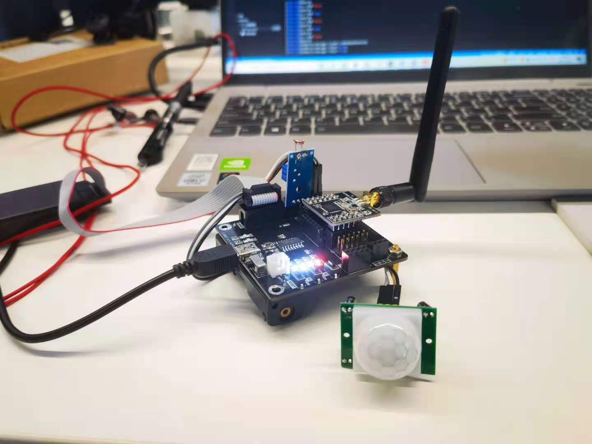

# 人体红外感知精灵 （ZDDC通讯）

## 环境
- 设备芯片: TI CC2530
- 开发工具：IAR Embedded Workbench for 8051 IDE  @ 10.10.1 

## 项目地址路径 
> Z-Stack 3.0.2/Projects/zstack/HomeAutomation/AcoinfoZigBeeSampleSmartInfrared/CC2530DB/acoinfoSample.eww

## GPIO 描述
- DATA_PIN_6 红外传感器
- DATA_PIN_5 光敏传感器

## 通道占用
名称 | 含义 | 控制描述 
---|---|---
dio0 | LED1 开关控制 | 可读写
dio1 | 人体监测状态  | 可读
dio2 | 光纤监测状态  | 可读
aio0 | 开发板电压数值| 可读
mem0 | 上报次数雷静  | 可读写

## 运行
- 每五秒上报一次当前环境数值
- 上报内容 光敏状态、人体红外状态、上报次数、当前电压
- S1按钮点击重新入网配对

## 相关链接
- [ZDDC 协议介绍](https://www.edgeros.com/ms-rtos/guide/zddc_introduction.html)
- [CC2530 ZDDC 设备开发](https://www.edgeros.com/ms-rtos/guide/cc2530_zddc_develop.html)