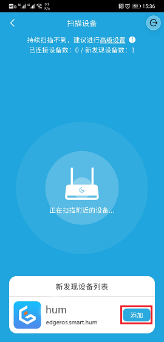

# 光感精灵 （ZDDC通讯）

## 环境
- 设备芯片: TI CC2530
- 开发工具：IAR Embedded Workbench for 8051 IDE  @ 10.10.1 

## 仓库地址
- https://github.com/edgeros/device-demo-smart-infrared.git
- https://gitee.com/edgeros/device-demo-smart-infrared.git
## 项目地址路径 
> Z-Stack 3.0.2/Projects/zstack/HomeAutomation/AcoinfoZigBeeSampleSmartInfrared/CC2530DB/acoinfoSample.eww

## GPIO 描述
- DATA_PIN_6 人体传感器
- DATA_PIN_5 光敏传感器

## 通道占用
名称 | 含义 | 控制描述 
---|---|---
dio0 | LED1 开关控制 | 可读写
dio1 | 人体监测状态  | 可读
dio2 | 光照监测状态  | 可读
aio0 | 开发板电压数值| 可读
mem0 | 上报次数  | 可读写

## 运行
- 每五秒上报一次当前环境数值
- 上报内容 光敏状态、人体红外状态、上报次数、当前电压
- S1按钮点击重新入网配对

## 上报数据格式
```
{
  "dio": true,
  "dio1": true,
  "dio2": false,
  "aio0": 3.1,
  "mem0": 1,
}
```

## 加入 EdgerOS 设备中心


## 代码示例
```
var Device = require('device');

// 获取所有iot设备信息
Device.list(true, function (error, list) {
  if (list) {
    list.forEach(function (dev) {
      let devObj = dev;
      Device.info(devObj.devid, function (error, info) {
        // 判断设备类型是否为光感精灵
        if (info.report.name == 'edgeros.smart.hum') {
          // 连接设备
          connectDev(devObj)
        }
      });
    });
  }
});

// 连接光感精灵
function connectDev(dev) {
  let iotpi = new Device();
  iotpi.request(dev.devid, function (error) {
    if (error) {
      console.log(`设备错误：${error.message}`);
    
    } else {
      console.log('连接成功');
      // 监听光感精灵上报的数据
      iotpi.on('message', function (msg) {
        console.log('iotpi-message', JSON.stringify(msg));
      });
    }
  });
}
```

## 相关链接
- [ZDDC 协议介绍](https://www.edgeros.com/ms-rtos/guide/zddc_introduction.html)
- [CC2530 ZDDC 设备开发](https://www.edgeros.com/ms-rtos/guide/cc2530_zddc_develop.html)